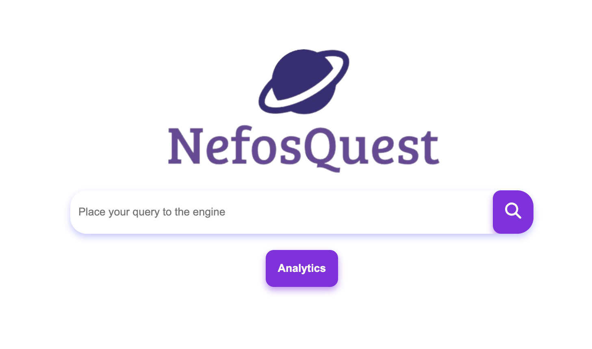

# Greek Parliament Speeches Search Engine & Analytics
This Python-based project offers a comprehensive solution for analyzing and exploring the speeches delivered in the Greek Parliament from 1989 to 2020. It provides a powerful search engine along with various analytics tools including keyword extraction, Latent Semantic Indexing (LSI), clustering, Named Entity Recognition (NER), and pairwise similarity computation.

## Key Features
- Speech Search Engine: Utilizes advanced search algorithms to enable users to efficiently search through the vast repository of parliamentary speeches.

- Keyword Extraction: Automatically identifies and extracts key terms and phrases from the speeches, aiding in content summarization and analysis.

- Pairwise Similarity Computation: Calculates the similarity between speeches, allowing for comparative analysis and identifying similarities between different parliamentary sessions.

- Latent Semantic Indexing (LSI): Applies LSI to uncover hidden relationships between terms and documents, facilitating a deeper understanding of the content's underlying structure.

- Clustering: Groups speeches into clusters based on similarity, providing insights into thematic trends and patterns over time.

- Named Entity Recognition (NER): Identifies and categorizes named entities such as people, organizations, and locations mentioned in the speeches, enriching the data for further analysis.

## How to Use
 Each task is accompanied by its own README.md file. These files provide detailed instructions for setting up the environment, running the scripts, and interpreting the results specific to each task. Before diving into the analysis, it's recommended to refer to the respective README.md file to ensure a smooth setup process and to understand the expected output formats.

## Demo
A demonstration of the application can be found at the following link: <https://youtu.be/9pT36bUvwyo>

## Bibliography
1. <https://github.com/hb20007/hands-on-nltk-tutorial/blob/main/7-1-NLTK-with-the-Greek-Script.ipynb>
2. <https://github.com/skroutz/greek_stemmer>
3. <https://github.com/stopwords-iso/stopwords-el>
4. <https://spacy.io/models/el>
5. <https://en.wikipedia.org/wiki/Named-entity_recognition>
6. <https://github.com/eellak/gsoc2018-spacy>
7. <https://stackoverflow.com/questions/76206507/spacy-where-are-terminologies-defined>
8. <https://whoosh.readthedocs.io/en/latest/schema.html>
9. <https://scikit-learn.org/stable/modules/generated/sklearn.feature_extraction.text.TfidfVectorizer.html>
10. <https://scikit-learn.org/stable/modules/generated/sklearn.metrics.pairwise.cosine_similarity.html>
11. <https://scikit-learn.org/stable/modules/generated/sklearn.decomposition.TruncatedSVD.html>

## Contact
For any questions, you can email at gatmatzidi@gmail.com

## Acknowledgments:
This project originated as a university endeavor for the Information Retrieval course within the Bachelor's degree program in Computer Science at Aristotle University of Thessaloniki. We extend our gratitude to the instructor and fellow students whose feedback and collaboration contributed to the development and refinement of this project.